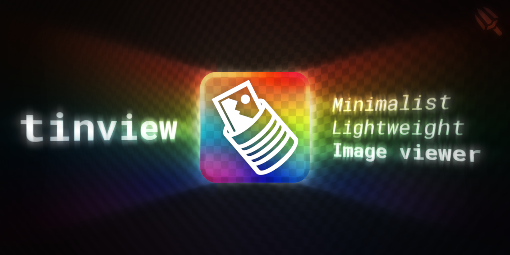
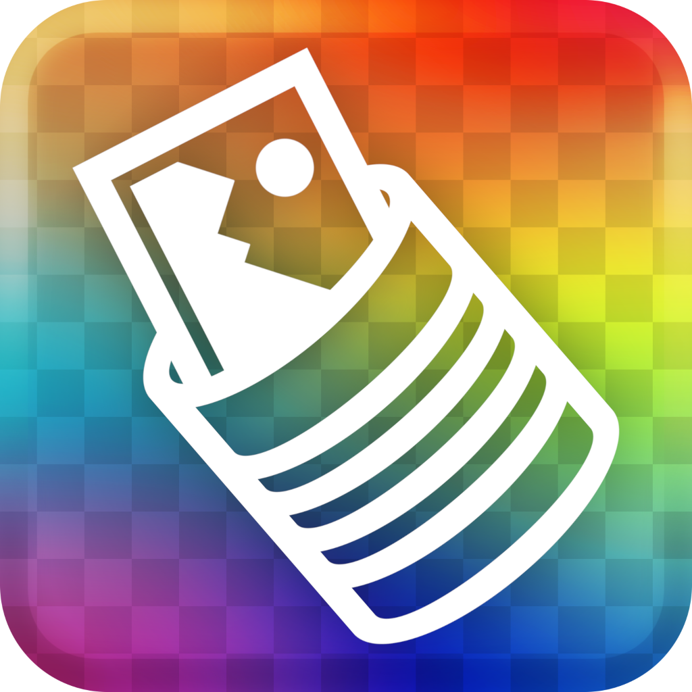

<a name="readme-top"></a>
<div align="center">
	
	<br>
	<a href="./LICENSE"></a>
	<a href="https://github.com/LordOfTrident/tinview/graphs/contributors"></a>
	<a href="https://github.com/LordOfTrident/tinview/stargazers"></a>
	<a href="https://github.com/LordOfTrident/tinview/issues"></a>
	<a href="https://github.com/LordOfTrident/tinview/pulls"></a>
	<p>A pretty and minimalist Linux image viewer</p>
	<p>
		<a href="#usage">Usage</a>
		·
		<a href="https://github.com/LordOfTrident/tinview/issues">Report Bug</a>
		·
		<a href="https://github.com/LordOfTrident/tinview/issues">Request Feature</a>
	</p>
	
	
	
</div>
<br>

<details>
	<summary>Table of contents</summary>
	<ul>
		<li>
			<a href="#introduction">Introduction</a>
			<ul>
				<li><a href="#why">Why</a></li>
			</ul>
		</li>
		<li>
			<a href="#pre-requisites">Pre-requisites</a>
			<ul>
				<li><a href="#debian">Debian</a></li>
				<li><a href="#arch">Arch</a></li>
			</ul>
		</li>
		<li><a href="#quickstart">Quickstart</a></li>
		<li><a href="#usage">Usage</a></li>
		<li><a href="#bugs">Bugs</a></li>
	</ul>
</details>

## Introduction
**tinview** is a lightweight and minimalist image viewer for Linux. It supports JPG, PNG, BMP,
HDR, TGA, PIC, PSD, PGM, PPM, and [PTF](https://platinumsrc.github.io/docs/formats/ptf/) images, as
well as animated GIFs. The code is only around 1.3k lines of C ([cloc](https://github.com/AlDanial/cloc)'ed),
and uses [stb_image](https://github.com/nothings/stb) for loading basic image formats, [libwebp](https://github.com/webmproject/libwebp)
for loading WEBP, [lz4](https://github.com/lz4/lz4) for help with loading PTF, [SDL2](https://www.libsdl.org/)
for GUI, and [tini](https://github.com/lordoftrident/tini) for parsing INI files.

When opened, all images passed by command line arguments can be browsed, as well as all images in
the browsing directory. The browsing directory is the parent directory of the first image provided
through command line arguments. If no files were provided, the current working directory is used.
Images are sorted by their names/paths in alphabetical order from A to Z.

<div align="center"></div>

### Why
I like minimalist and unbloat software, so the image viewer I used before is [feh](https://github.com/derf/feh).
However, I had a few issues with it - it cant't play gifs, and the controls felt very clunky. It
wasn't very smooth, and felt a bit unintuitive. Because of this, I decided I will make an image
viewer which will work and look exactly the way I want it to. And so, tinview was born.

## Pre-requisites
The only external dependency of the program is [SDL2](https://www.libsdl.org/). However, to compile
it, you will also need [GNU make](https://www.gnu.org/software/make/) and xxd.

### Debian
```
$ apt install libsdl2-dev make xxd
```

### Arch
```
$ pacman -S sdl2 make xxd
```

## Quickstart
```sh
$ git clone https://github.com/LordOfTrident/tinview
$ cd tinview
$ make install
$ tinview res/icon.png
```

## Usage
For usage information, see the man page:
```
$ man ./tinview.1
```
Or, if you've installed tinview:
```
$ man tinview
```

## Bugs
If you find any bugs, please, [create an issue and report them](https://github.com/LordOfTrident/tinview/issues).

<br>
<hr>
<br>

<div align="center">
	
	<br>
	<a href="https://en.wikipedia.org/wiki/C_(programming_language)">
		
	</a>
	<a href="https://www.libsdl.org/">
		
	</a>
	<p align="center">Made with love <3</p>
</div>

<p align="right">(<a href="#readme-top">Back to top</a>)</p>
